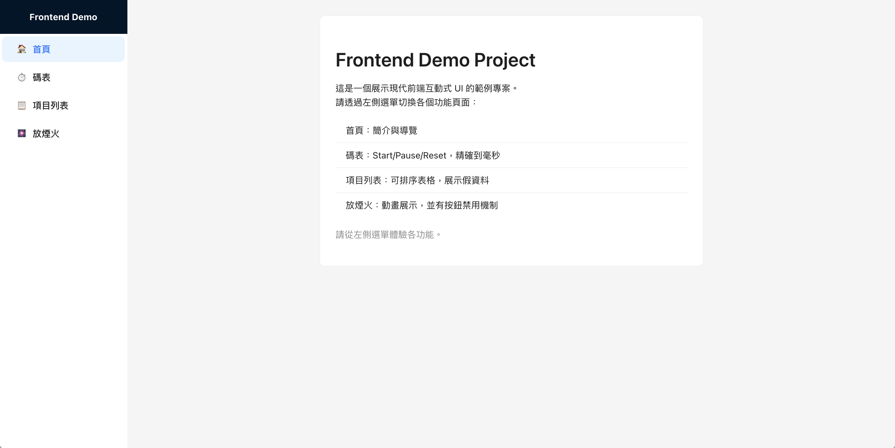

# Frontend Demo Project

This is a demonstration project for frontend interactive UI development.



## Features

- Sidebar Layout
- Home: Usage introduction
- Stopwatch: Start/Pause/Reset Timer
- Item List: Sortable table
- Firework Animation

## Environment

- Node.js 18.x, 20.x, or 22.x (recommended: Node.js 20)
- npm (v10+)
- Modern browser (Chrome, Edge, Firefox, Safari)

## Quick Start

Clone the repository and install dependencies:

```bash
git clone https://github.com/reshine710/FrontendDemo.git
cd FrontendDemo
npm install
```

Start the development server:

```bash
npm run dev
```

The app will be available at http://localhost:5173 (or the next available port).

## Tech Stack

- Vite
- React
- TypeScript
- TailwindCSS
- React Router
- Ant Design (UI)
- fireworks-js (animation)

## Project Structure

```other
src/
 ├── components/
 ├── pages/
 ├── layouts/
 ├── utils/
 ├── constants/
 └── main.tsx
```

## Contact Me

如需更多資訊或合作洽談，歡迎聯絡：
- Email: regain.sunshine@gmail.com
